# Ekstraklasa 25/26 — losowa czy wyrównana?

*Tabela najbardziej zbita w historii ligi. Co mówią o tym liczby?*

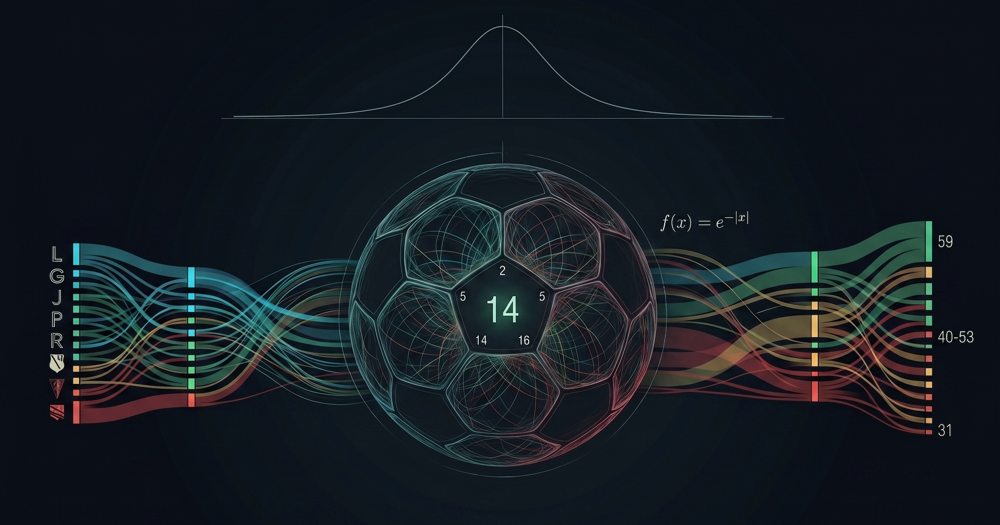

---

Tegoroczna Ekstraklasa skończyła się dziwną tabelą. Między 6. miejscem (bezpośrednia walka o puchary) a 15. (bezpośrednia walka o utrzymanie) jest tylko **8 punktów** różnicy. W Bundeslidze, Serie A i Ligue 1 ta sama różnica wynosi **25-27 punktów**.

Coraz więcej osób zwraca uwagę na anomalię, jaką jest tegoroczna Ekstraklasa. Pewnie powstało już sporo materiałów opisujących, co dzieje się w polskiej lidze. Patrząc na ten stan rzeczy, zastanawiam się, co jest tego powodem i co to mówi o polskiej piłce. Czy Ekstraklasa rzeczywiście jest taka wyrównana i dlaczego? A może po prostu losowa, a awanse do pucharów i spadki to dzieło przypadku?

Śląsk Wrocław w sezonie 23/24 bił się o mistrza i został wicemistrzem, a rok później spadł z ligi. Czy takie zwroty świadczą o tym, że liga to kompletna loteria, czy raczej o tym, że poziom jest tak wyrównany, że każda drużyna może w jednym sezonie zjechać w dół albo skoczyć w górę?

Sięgnę po klasyczne narzędzia ekonomii sportu (modele statystyczne, kursy bukmacherskie, symulacje Monte Carlo), żeby zdiagnozować sytuację i dociec, co naprawdę za nią stoi.

## Jak dziwna jest tabela?

Spłaszczenie tabeli da się zmierzyć. Najprostsza miara to odchylenie standardowe (ASD, *Actual Standard Deviation*): jak bardzo drużyny różnią się punktami od ligowej średniej. Dla Ekstraklasy 25/26 wynosi ono **6.82 punktu**. W Top 5 europejskich ta liczba waha się od 15.4 (EPL) do 17.8 (Serie A). Ekstraklasa jest około dwa i pół raza mniej rozpięta.

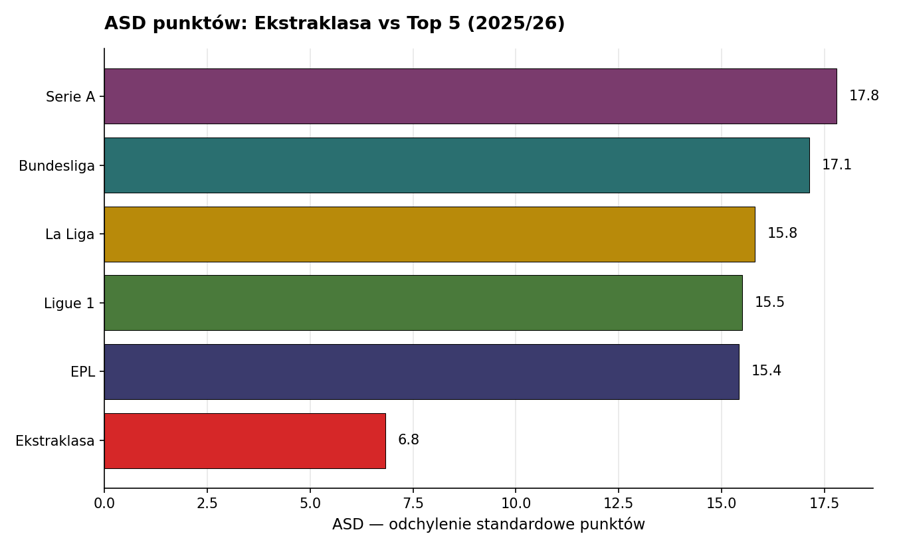

Samo odchylenie ma jedną wadę: zależy od długości sezonu. Porównując ligę 34-meczową (Ekstraklasa) z 38-meczową (EPL), dłuższy sezon naturalnie kumuluje więcej punktów i daje wyższe odchylenie. Dlatego sport economics ma narzędzie specjalnie do takich porównań: wskaźnik Noll-Scully (NS), który odchylenie normalizuje do punktu odniesienia, czyli hipotetycznej ligi, w której wszystkie drużyny są tej samej klasy i wynik jest kwestią przypadku.

> *W liczbach:* ASD (Actual Standard Deviation) to faktyczne odchylenie standardowe punktów w tabeli. ISD (Idealized Standard Deviation) to odchylenie standardowe punktów dla hipotetycznej ligi, w której wszystkie drużyny są tej samej klasy, a wynik każdego meczu zależy tylko od przypadku, przy realistycznym dla piłki nożnej odsetku remisów ~25%. NS (wskaźnik Noll-Scully, od nazwisk ekonomistów Rogera Nolla i Geralda Scully) to standardowa miara równowagi konkurencyjnej w lidze sportowej; NS = ASD / ISD. Wartość 1.0 oznacza, że rozproszenie tabeli wygląda dokładnie tak, jakby drużyny były nieodróżnialne klasowo. Wartości typowe w Top 5 Europy: 1.9–2.2. Poniżej 1.0 (czyli tabela ciaśniejsza niż w lidze losowej) zdarza się ekstremalnie rzadko.

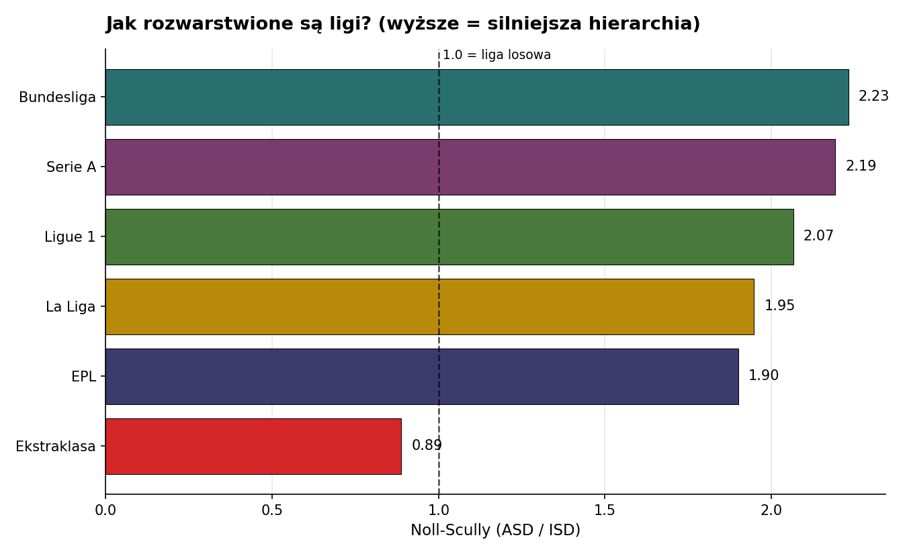

Po raz pierwszy w historii tej ligi NS spadł poniżej 1.0. W 13 poprzednich sezonach Ekstraklasy wskaźnik oscylował między 1.25 a 1.86. Tegoroczne 0.89 to nie tylko rekord — to przekroczenie progu, który oznacza: tabela jest ciaśniejsza niż wynikałoby z samej losowości piłki nożnej.

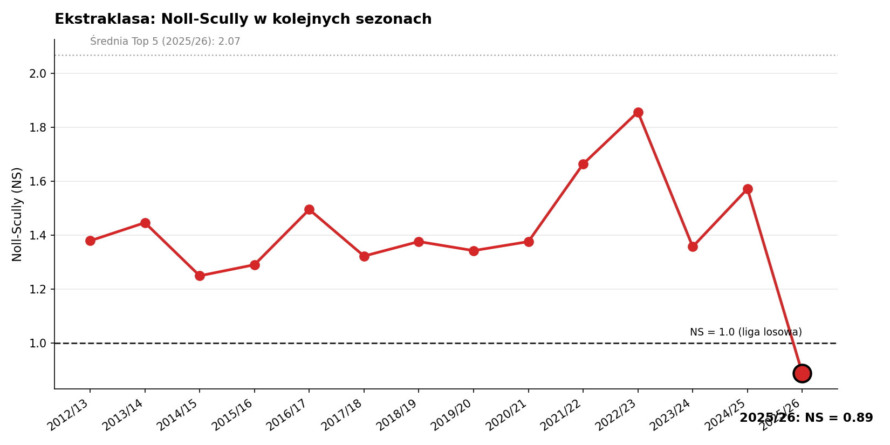

## Wyrównanie i losowość — to nie to samo

Zanim cokolwiek policzymy dalej, trzeba postawić jasną różnicę między dwoma wyjaśnieniami spłaszczonej tabeli. Brzmią podobnie, ale to dwa różne zjawiska.

**Wyrównanie** to sytuacja, w której drużyny są realnie podobnej klasy. Mecz wygra ten, który tego dnia był odrobinę lepszy. W skali sezonu różnice się prawie zacierają, każdy zbiera podobną liczbę punktów. Tabela jest zbita, bo wszyscy są realnie tej samej klasy.

**Losowość** to coś innego. Drużyny *są* różne: jedne lepsze, drugie słabsze. Ale wyniki tego nie pokazują. Tabela jest zbita, ale to nie odzwierciedla realnej jakości drużyn. To artefakt nieprzewidywalności pojedynczych spotkań.

Pierwsza wersja to *liga wyrównana*: ciaśniejsza, ale uczciwa rozgrywka. Druga to *liga nieprzewidywalna*: chaos przykrywający realne różnice klas.

Obie wersje wyglądają tak samo w tabeli, ale prowadzą do zupełnie różnych wniosków o stanie ligi. Żeby je rozróżnić, potrzebujemy spojrzeć na kształt rozkładu punktów, a nie tylko na jego szerokość.

## Co mówi kształt tabeli

Spójrzmy na oba rozkłady punktów jednocześnie. Ekstraklasa vs Bundesliga:

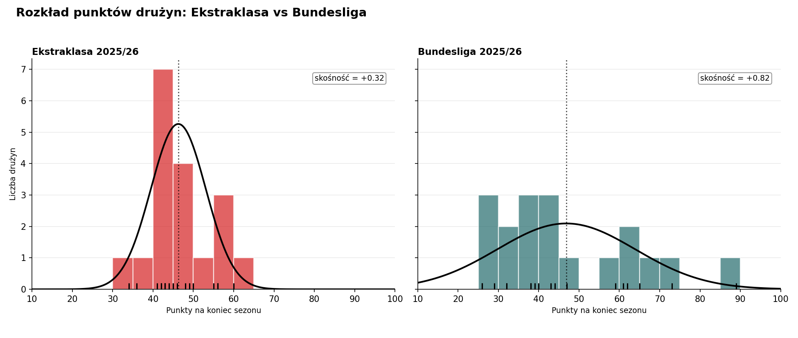

W Bundeslidze klasy drużyn widać już na histogramie. Bayern Monachium z 89 punktami, na dole St. Pauli i Heidenheim z 26. Rozpiętość 63 punkty. Histogram pokazuje wyraźną hierarchię: lider, czołówka, środek, dół.

W Ekstraklasie wszystkie 18 drużyn tłoczą się w przedziale 34–60 punktów. Rozpiętość 26 punktów. Histogram ma wyraźną, wąską górkę. Krzywa rozkładu normalnego leży blisko słupków, bo rzeczywiście jest to jeden skupiony rozkład, nie kilka nakładających się klas.

| Liga            | Rozpiętość (pkt) | Min – Max |
| --------------- | ---------------- | --------- |
| **Ekstraklasa** | **26**           | 34 – 60   |
| Ligue 1         | 59               | 17 – 76   |
| Bundesliga      | 63               | 26 – 89   |
| EPL             | 65               | 20 – 85   |
| La Liga         | 65               | 29 – 94   |
| Serie A         | 69               | 18 – 87   |

Rozkład Ekstraklasy jest praktycznie symetryczny: ani lider nie ucieka czołówce, ani drużyny ze strefy spadkowej nie odstają od reszty. W praktyce: lider Ekstraklasy ma 14 punktów więcej niż średnia drużyna w lidze. Barcelona: 42 punkty więcej. Bayern: 42. Inter: 35. Ekstraklasa to jedyna z sześciu lig, w której czołówka nie ma "uciekiniera".

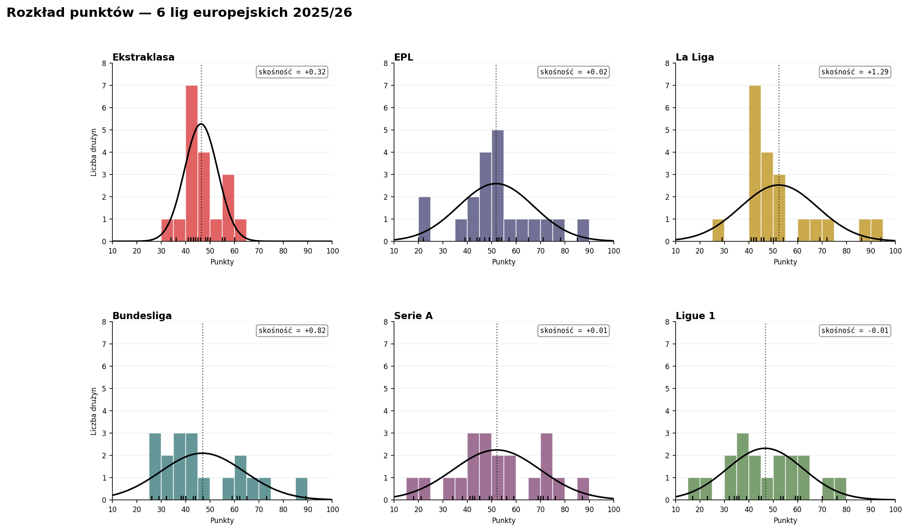

## Model klas drużyn

Histogram przekonuje wizualnie, ale można pójść głębiej. Z wyników wszystkich rozegranych meczów Ekstraklasy możemy dla każdej drużyny wyestymować dwie liczby: siłę ataku (ile strzela) i siłę obrony (ile wpuszcza). Na tej podstawie wylicza się jedną liczbę: klasę drużyny, która oddaje ogólną siłę drużyny niezależnie od losowości w pojedynczych meczach.

> *Model formalnie:* Gole w meczu modelowane jako rozkład Poissona z parametrem λ = exp(atak − obrona_przeciwnika + przewaga_pola). Klasa drużyny = atak + obrona. Model Mahera (1982).

Co z tego wychodzi? Rozrzut klas drużyn, czyli jak daleko od siebie są najsilniejsze i najsłabsze (mierzony odchyleniem standardowym SD parametru klasy), w Ekstraklasie wynosi **0.22**. W EPL i La Lidze to około 0.39, w Bundeslidze 0.45. Ekstraklasa jest **dwa razy bardziej zbita klasowo** niż Premier League, **ponad dwa razy** niż Bundesliga. Różnica między najsilniejszą drużyną Ekstraklasy (Lech Poznań) a najsłabszą (Arka Gdynia) jest mniejsza niż różnica między Barceloną a piątym Realem Betis.

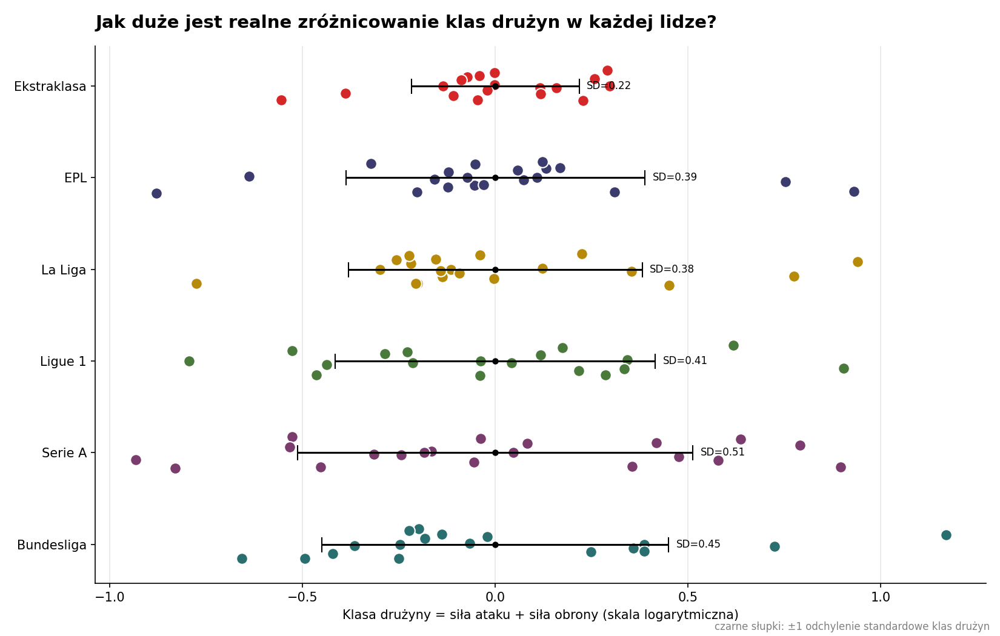

Z perspektywy modelu wniosek jest taki sam: drużyny są realnie zbliżone klasą, kompresja tabeli to nie przypadek.

## Model wyrównanej ligi

Skoro znamy klasy drużyn z poprzedniego rozdziału, można zadać pytanie: gdyby ta liga rozegrała sezon jeszcze raz (drużyny te same, klasy te same, ale wyniki każdego meczu wylosowane na nowo zgodnie z modelem), jak rozłożyłyby się punkty?

Odpowiedź daje symulacja Monte Carlo. Patrzymy, jakie końcowe ASD daje każdy z 5000 symulowanych światów.

> *Symulacja Monte Carlo:* technika obliczeniowa polegająca na wielokrotnym losowym próbkowaniu. W naszym przypadku: dla każdej z 5000 powtórek sezonu klasy drużyn pozostają stałe, ale wynik każdego meczu jest losowany na nowo (gole z rozkładu Poissona zgodnego z modelem). Z każdej powtórki liczymy końcową tabelę i jej ASD.

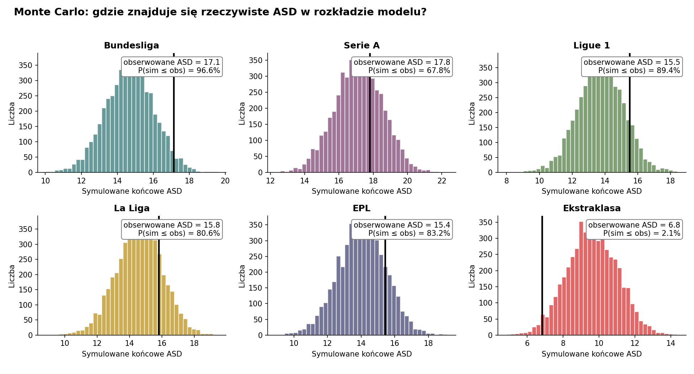

Każdy panel to histogram dla jednej ligi. Słupki pokazują, ile z 5000 symulowanych sezonów dało dane ASD: im wyższy słupek, tym częściej taki wynik się pojawił. Czarna pionowa linia to faktyczne ASD obecnego sezonu; jej położenie względem słupków mówi, jak typowym lub nietypowym wynikiem byłaby realna kompresja. Etykieta P(sim ≤ obs) podaje to liczbowo: w ilu symulowanych sezonach ASD wyszło tak niskie lub niższe od rzeczywistego.

We wszystkich ligach Top 5 realne ASD jest **wyższe** niż średnia z symulacji modelu, czyli w tabeli pojawia się więcej rozjazdu niż czysta statystyka by sugerowała. Wszystkie pięć mieści się w zakresie typowych alternatywnych światów. Jedyna liga, która wypada wyraźnie poza ten zakres, to Ekstraklasa — i to w **odwrotną stronę**. Symulowane średnie ASD: **9.6**. Realne: **6.82**. Tylko **2% alternatywnych światów** z naszego modelu daje tabelę tak ciasną jak rzeczywista.

Nawet model, który zna prawdziwe klasy drużyn Ekstraklasy, oczekiwałby tabeli wyraźnie szerszej niż faktycznie widzimy. **Same różnice klasowe nie tłumaczą wszystkiego.** Coś jeszcze dociska tę tabelę poniżej tego, co statystyka przewiduje. Wrócimy do tego w podsumowaniu.

## Bukmacherzy widzą to samo

Bukmacherzy to pierwszorzędni analitycy piłkarscy. Ich kursy wynikają z modeli statystycznych podobnych do tego, którego użyliśmy — tyle że na większej skali, z dodatkowymi danymi (kontuzje, skład, większa waga świeższych meczów) i zwykle jako kombinacja kilku podejść jednocześnie.

Dla każdego meczu sezonu 2025/26 wzięliśmy uśrednione kursy zamknięcia z wielu bukmacherów (im bliżej startu meczu, tym więcej informacji wchłonął kurs) na wygraną gospodarza, remis i wygraną gościa. Kurs przeliczono na prawdopodobieństwo (1/kurs), usunięto marżę bukmachera, a drużynę z wyższym prawdopodobieństwem wygranej nazwano "faworytem". Dla każdej ligi policzono: jakie było średnie prawdopodobieństwo przypisane faworytowi oraz ile razy faworyt rzeczywiście wygrał.

| Liga        | Średnie prawdopodobieństwo wygranej faworyta wg bukmacherów | Faworyci wygrywają w |
| ----------- | ----------------------------------------------------------- | -------------------- |
| Ekstraklasa | **46%**                                                     | **42%**              |
| EPL         | 52%                                                         | 49%                  |
| La Liga     | 50%                                                         | 54%                  |
| Bundesliga  | 52%                                                         | 57%                  |
| Serie A     | 52%                                                         | 54%                  |
| Ligue 1     | 53%                                                         | 55%                  |

W Top 5 bukmacherzy dają faworytowi średnio 52% szans, w Ekstraklasie 46%. Czyli bukmacherzy nie wskazują silnych faworytów.

Co więcej, we wszystkich ligach Top 5 (poza EPL) faworyci wygrywają **częściej** niż bukmacherzy przewidywali (różnica +2 do +5 punktów procentowych). W Ekstraklasie **rzadziej** (−4pp). Nawet bukmacherzy nie do końca doceniają, jak ciasna jest ta liga.

## Hierarchia istnieje

Wyrównanie nie oznacza przypadkowości i wyniki to potwierdzają. Lech Poznań jest mistrzem drugi sezon z rzędu. Jagiellonia, Raków i Legia znów w czołówce. Dwaj z trzech beniaminków (Termalica i Arka Gdynia) na dole tabeli, tak jak ekonomia piłki nożnej nakazuje. 

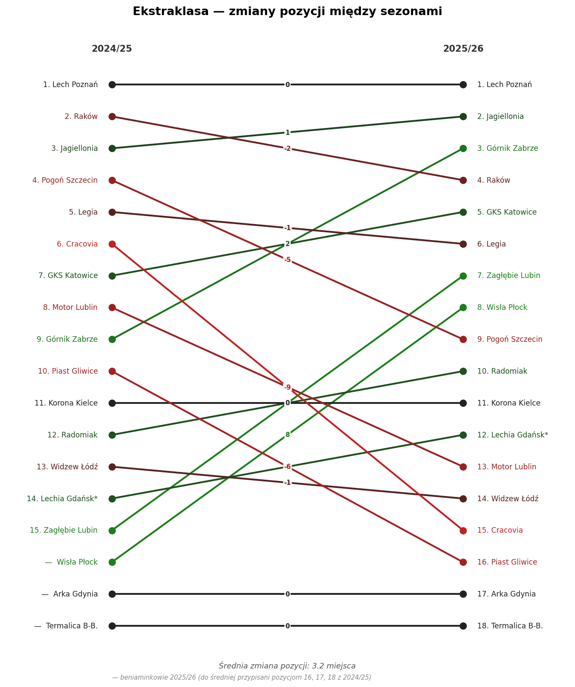

*\*Lechia Gdańsk rozpoczęła sezon 25/26 z karą administracyjną −5 punktów. Na powyższym wykresie i w całej analizie Lechia ma 43 pkt z meczów i 12. miejsce — sportowo. Oficjalnie, po odjęciu kary, Lechia ma 38 pkt i 16. miejsce, co oznacza spadek z ligi. Analiza opiera się na realnych wynikach meczów.*

Średnia zmiana pozycji między sezonami to 3.2 miejsca. Drużyny się przesuwają, ale nie rewolucjonizują tabeli. W Ekstraklasie 25/26 jest po prostu mniej drużyn, które wyraźnie odstają w górę lub w dół. Ale hierarchia istnieje, tylko jest ciaśniej upakowana.

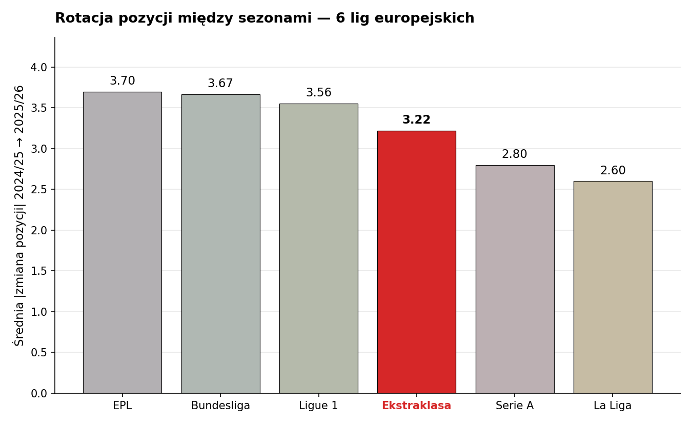

Porównanie z innymi ligami potwierdza obserwację. Średnia rotacja pomiędzy pozycjami Ekstraklasy (3.2) mieści się w środku zakresu lig europejskich (od 2.6 w La Lidze do 3.7 w EPL). Nie odstaje "chaotycznie" od reszty Europy.

## Co mówią liczby

Wracając do pytania, od którego zaczęliśmy: czy Ekstraklasa 25/26 jest **losowa, czy wyrównana**? Liczby dają jedną odpowiedź. Wyrównana. I to bardziej, niż jakikolwiek model by przewidział. O losowości można powiedzieć nawet więcej: została nad wyraz stłumiona.

Drużyny są realnie podobnej klasy. Model Mahera pokazuje to wprost: rozrzut sił klas o połowę węższy niż w Top 5. Bukmacherzy widzą to samo: faworyt dostaje średnio 46% szans (vs 52% w Top 5), a w pełnym sezonie wygrywa nawet **rzadziej** niż ich modele przewidywały (42%). Rzeczywistość okazała się jeszcze ciaśniejsza niż prognoza.

Symulacja Monte Carlo używająca prawdziwych klas drużyn przewidywałaby ASD punktów rzędu 9.6, bo statystyka mówi, że nawet z tymi klasami konkretne wyniki będą się wahać szeroko i pojawią się różnice punktowe pomiędzy drużynami. Mamy 6.82. Wariancja per-mecz **nie materializuje się** tak, jak teoretyczny model przewiduje.

Co ciekawe, na poziomie pojedynczych meczów Ekstraklasa wygląda nieodróżnialnie od reszty Europy:
- Średnia goli na mecz: 2.74 vs 2.79 w Top 5 (różnica minimalna)
- Odsetek meczów z różnicą ≥ 2 gole: 34.3% vs 35.6% (bardzo podobny)
- Odsetek remisów: 27.8% vs 25.3% (większy, ale nie znacząco)

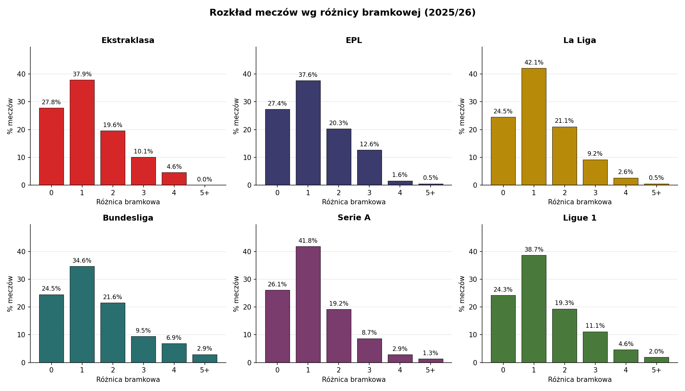

A jednak hierarchia się ustawia. Lech jest pierwszy, Termalica ostatnia. Przez 34 mecze drobne przewagi klasowe kumulują się w stabilny porządek. W lidze tak ciasnej decyduje nie wielka przewaga, tylko **margines** wystarczający, żeby tabela miała sens. Średnia rotacja pozycji między sezonami w Ekstraklasie to 3.2 miejsca, w EPL 3.7, w Bundeslidze 3.7. Wszystkie wyraźnie poniżej ~6, których oczekiwalibyśmy w lidze całkowicie losowej.

Wracając do przypadku Śląska Wrocław: wicemistrz 23/24, spadek w kolejnym sezonie. To nie dowód losowości ligi, tylko **czułość ciasnej tabeli na zmiany w jednej drużynie**. Mała erozja formy (odejścia kluczowych zawodników, nieudane transfery, kontuzje) przekłada się tu na kilkanaście miejsc spadku zamiast jednego-dwóch. Nie ma bufora punktowego, który tłumiłby konsekwencje.

Ekstraklasa 25/26 nie jest chaotyczna. Jest **bardziej wyrównana, niż powinna być**. Nawet model, który zna prawdziwe klasy drużyn, w 98% alternatywnych sezonów rozsuwa tabelę szerzej, niż widzimy w rzeczywistości. Ekstraklasa to liga, która **opiera się rozsuwaniu**. Jakby działała na nią jakaś siła dociskająca. Coś, co przy każdym meczu zabiera trochę z przewagi silniejszego i oddaje słabszemu. Liczby nie mówią, co to za siła. Ale mówią jasno, że istnieje i że jej śladu nie da się wytłumaczyć ani samymi klasami drużyn, ani przypadkiem.

Co Ekstraklasę ściska? To pytanie może już wychodzić poza samą statystykę punktów. Potrzeba głębszej analizy i wejścia w taktykę, ekonomię ligi czy strukturę kadr. Tym zajmę się w kolejnym artykule. Bo jeśli w Ekstraklasie działa jakaś dziwna siła powodująca tak duże anomalie, warto ją poznać.

---

*Uwagi metodologiczne: Noll-Scully policzony z poprawką na remisy (q = 0.25), bardziej naturalna miara dla piłki nożnej niż klasyczna formuła Quirka-Forta zakładająca binarne wyniki. Symulacja MC zakłada, że klasa drużyny jest stała przez cały sezon; w rzeczywistości kontekst meczu wpływa na poziom gry, czego model nie chwyta. Rotacja pozycji: beniaminkowie 25/26 sparowani z dolnymi pozycjami sezonu 24/25 w sposób minimalizujący średnią zmianę. Wartość pokazana w artykule to dolne ograniczenie faktycznej rotacji; we wszystkich ligach liczone tą samą zasadą, więc porównanie między ligami zachowuje sens.*

---

*Dane: wyniki wszystkich meczów Ekstraklasy 2012–2026 oraz sezonu 2025/26 sześciu lig europejskich (źródło: [football-data.co.uk](https://www.football-data.co.uk/), średnie kursy zamknięcia z wielu bukmacherów). Analiza obejmuje miary rozproszenia punktów (ASD, Noll-Scully), kalkulację siły drużyn na podstawie strzelanych i wpuszczanych goli (model Maher 1982), kalibrację kursów bukmacherskich (Brier, Murphy decomposition) oraz symulacje Monte Carlo (5000 alternatywnych sezonów na ligę). Pełny kod, dane i wygenerowane wykresy: [github.com/tmorcinek/ekstraklasa-analysis](https://github.com/tmorcinek/ekstraklasa-analysis).*
