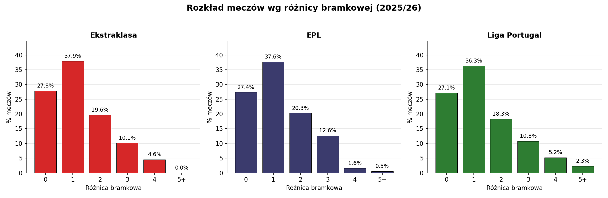
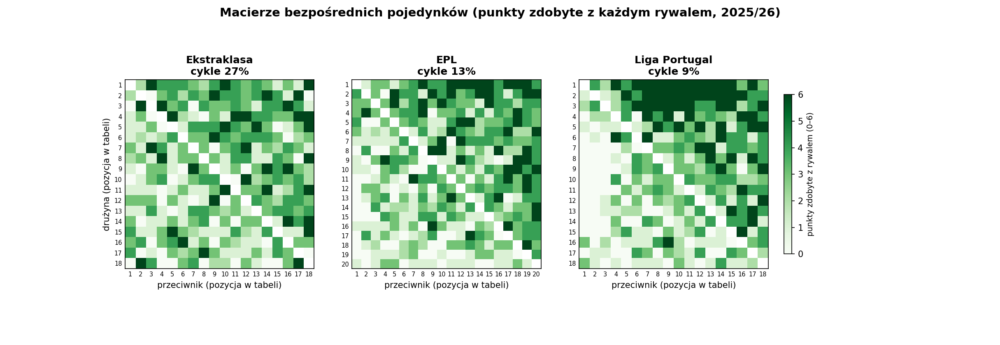
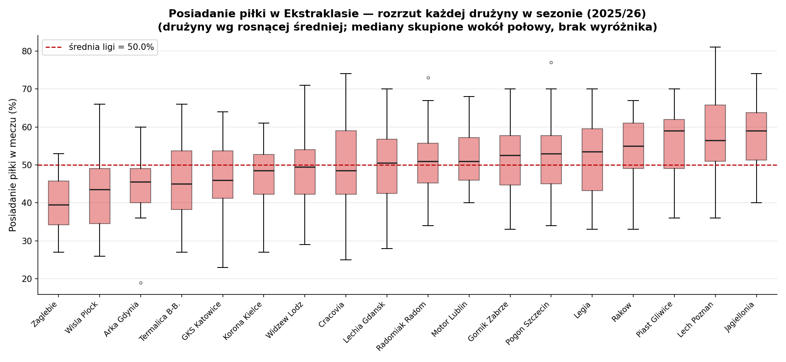
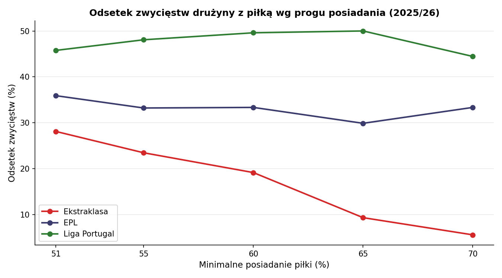
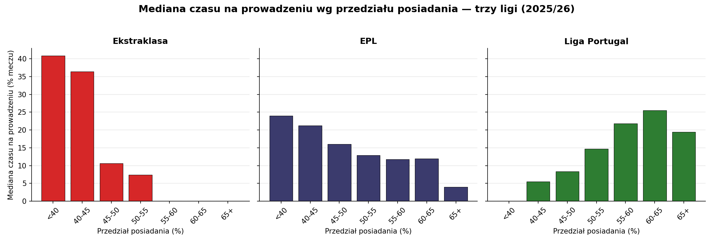
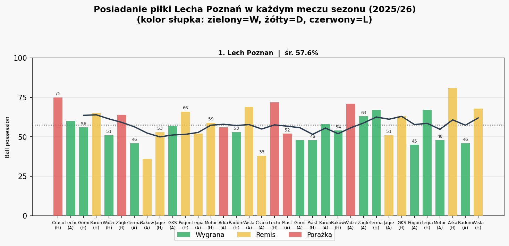
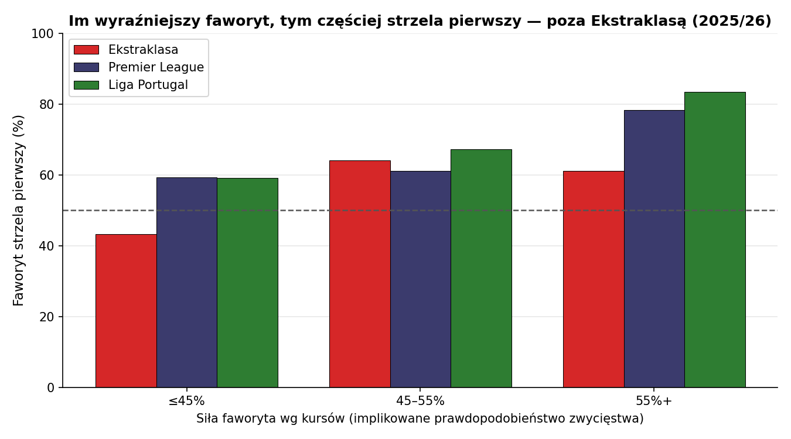
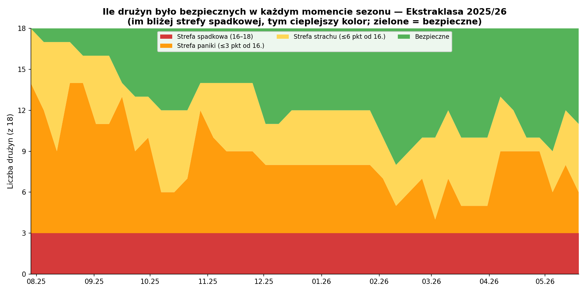

# Co ściska tabelę Ekstraklasy?

*Wyrównana, nie losowa — a mimo to za ciasna. W poszukiwaniu siły, która ją dociska.*

---

Diagnoza z pierwszej części była jasna, ale zostawiła zagadkę. Gdyby ten sezon rozegrać od nowa setki razy, znając prawdziwą siłę każdej drużyny, niemal zawsze tabela wychodziłaby szersza niż ta, którą oglądamy. Tak ciasno jak naprawdę kończy się ledwie w **dwóch sezonach na sto**.

Zostaje luka, której nie tłumaczą ani różnice klas, ani przypadek — model uwzględnia jedno i drugie. Jakby na ligę działała **siła dociskająca**: coś, co przy każdym meczu zabiera trochę z przewagi silniejszego i oddaje słabszemu. Faworyt nie zamienia klasy na punkty tak, jak powinien; underdog wynosi z meczu więcej, niż mu się należy.

## Mecz jak każdy inny

Zanim zaczniemy szukać winnego, warto wykluczyć najprostsze wyjaśnienie: że mecze w Ekstraklasie po prostu wyglądają inaczej. Mniej goli, więcej remisów, ostrożna gra na zero z tyłu — gdyby tak było, kompresja tabeli tłumaczyłaby się sama.

Okazuje się jednak, że spośród wszystkich lig w Europie dwie pod względem wyników meczów wyglądają niemal nieodróżnialne od Ekstraklasy: angielska Premier League i portugalska Liga Portugal. Pada w nich tyle samo goli na mecz (2.74 w Ekstraklasie, 2.75 w Anglii, 2.68 w Portugalii), notują niemal identyczny odsetek remisów (27.8%, 27.4%, 27.1%), a co najważniejsze, niemal pokrywają się rozkładem różnicy bramkowej.

Te trzy słupkowe wykresy to praktycznie ten sam obraz. Mniej więcej co czwarty mecz kończy się remisem, blisko 40% różnicą jednego gola, a wysokie rozstrzygnięcia (cztery gole i więcej) są rzadkie w każdej z lig. Podobne wyniki, ta sama nieprzewidywalność pojedynczego spotkania, a punkty na koniec sezonu rozkładają się zupełnie inaczej. Skoro nie różni ich sam przebieg i struktura meczów, różnica musi tkwić w tym, które drużyny najczęściej zgarniają pełną pulę.

## Mozaika i trójkąt

Najlepiej widać to na macierzy bezpośrednich pojedynków: każdy wiersz to jedna drużyna (uszeregowane według końcowej tabeli, od lidera u góry), każda kolumna to rywal, a kolor komórki mówi, ile punktów drużyna ugrała z tym rywalem w dwóch meczach — od 0 (jasny) do 6 (ciemnozielony).

W Anglii i Portugalii układa się z tego **trójkąt**. Ciemna zieleń zbiera się w prawym górnym rogu: drużyny z czoła tabeli regularnie biorą komplet punktów od tych z dołu, a im niżej rywal, tym mniej zostaje dla słabszego. Hierarchia z tabeli odtwarza się w niemal każdej parze. Silniejszy ogrywa słabszego, dokładnie tak jak podpowiada porządek.

W Ekstraklasie zamiast trójkąta jest **mozaika**: ciemne i jasne pola rozsypane bez związku z pozycją w tabeli. Lider gubi punkty z drużynami z dołu, środek wymienia się punktami w obie strony, a wynik pojedynczej pary niewiele mówi o tym, która drużyna stoi w tabeli wyżej.

Tę różnicę da się policzyć, licząc **cykle**. Cykl to układ jak w grze w kamień-papier-nożyce: drużyna A ogrywa B, B ogrywa C, ale C ogrywa A. W czystej hierarchii cykli nie ma — jeśli A jest lepsze od B, a B od C, to A powinno pokonać również C. Im więcej cykli, tym słabiej wyniki układają się w jeden spójny porządek. Wśród wszystkich rozstrzygniętych trójek drużyn cykle stanowią w Liga Portugal 9%, w Premier League 13%, a w Ekstraklasie **27%** — niemal tyle, ile dałoby czyste losowanie (25%).

## W poszukiwaniu stylu

Czy da się w ogóle odnaleźć styl gry w liczbach? Wybrałem cztery ofensywne cechy istniejące w dostępnych danych, które mogą go opisać: procent posiadania piłki, liczbę podań, procent długich podań oraz procent podań w tercji ataku. Każda coś mówi o tym, jak drużyna chce grać. Posiadanie i liczba podań: czy zespół chce mieć piłkę i ją rozgrywać. Procent długich podań zdradza, czy atakuje bezpośrednio, czy cierpliwie buduje. A udział podań w tercji ataku mówi, czy utrzymuje piłkę wysoko pod bramką rywala, czy raczej broni się głęboko i wyprowadza kontry.

Te statystyki da się wyciągnąć z każdego meczu i zebrać dla każdej drużyny w obraz całego sezonu; wtedy widać, czy któryś zespół odstaje od reszty. Samo posiadanie, mecz po meczu, pokazuje już, z czym mamy do czynienia:

Każde pudełko to jedna drużyna: jego wysokość pokazuje, jak bardzo posiadanie skacze jej z meczu na mecz, a kreska w środku to mediana. Drużyny ustawiono od najniższego do najwyższego średniego posiadania. Mimo że pojedyncze mecze rozrzucają się szeroko (od ~30% do ~70%), mediany wszystkich osiemnastu zespołów skupiają się wokół połowy, a pudełka mocno na siebie zachodzą. Żadne nie odrywa się od reszty.

To samo widać, gdy każdą cechę zważyć liczbą. Dla każdej można policzyć rozrzut drużyn wokół ligowej średniej: im mniejszy, tym zespoły bardziej do siebie podobne. We wszystkich czterech cechach rozrzut w Ekstraklasie jest najmniejszy z trzech lig, a żadna drużyna nie wystaje z grupy:

| Cecha | Ekstraklasa | EPL | Liga Portugal |
|---|---|---|---|
| Posiadanie | **9.9%** | 11.4% | 12.8% |
| Liczba podań | **13.1%** | 14.4% | 19.6% |
| Długie podania (% podań) | **19.9%** | 21.1% | 26.9% |
| Podania w tercji ataku | **6.3%** | 8.7% | 12.2% |
| **Drużyny odstające (outliery)** | **0** | **0** | **2** |

Outlier to drużyna, która odbiega od ligowej średniej na tyle mocno, że statystycznie nie mieści się już w rozkładzie. W lidze portugalskiej takie drużyny są: Sporting i Braga wyróżniają się bardzo wysokim posiadaniem i narzucają grę piłką. W Ekstraklasie nie ma ani jednej — są tylko delikatne odchyły od średniej.

Drużyna bez własnego stylu nie narzuca rywalom swoich warunków — a to jeden z kanałów, którymi klasa przekłada się na punkty.

## Kto ma piłkę, ten goni

Zostańmy jeszcze przy posiadaniu i policzmy wprost, co drużyna z niego ma. W każdej lidze da się narysować prostą linię: na osi poziomej próg posiadania, na pionowej odsetek zwycięstw drużyn, które ten próg przekroczyły. W Ekstraklasie ta linia wyraźnie opada. Już przy minimalnej przewadze przy piłce (51%) odsetek zwycięstw jest niższy niż w pozostałych ligach, a im wyższy próg, tym gorzej: przy 70% posiadania drużyna wygrywa **1 mecz na 18**. W Liga Portugal ta sama linia rośnie: więcej piłki to więcej wygranych. W Premier League jest w miarę płaska: posiadanie nie pomaga, ale przynajmniej nie szkodzi. Jeśli gdziekolwiek teza, że posiadanie piłki nie daje zwycięstw, jest szczególnie prawdziwa — to właśnie w Ekstraklasie.

To nie jest kwestia jednego progu. Ten sam obraz daje czas spędzony na prowadzeniu, mierzony na całym zakresie posiadania. W Ekstraklasie im więcej piłki, tym **mniej** minut na prowadzeniu — przy najwyższym posiadaniu mediana spada do zera. W Liga Portugal jest dokładnie odwrotnie: im więcej piłki, tym **dłużej** drużyna prowadzi. Anglia leży pośrodku. Najważniejsze, że **znak się odwraca** — to, co w Polsce zapowiada brak prowadzenia, w Portugalii zapowiada prowadzenie.

Skąd ta odwrotność? Im głębiej wejść w mecze z wysokim posiadaniem, tym wyraźniej widać:

> ***W Ekstraklasie posiadanie nie jest przyczyną wyniku, lecz jego objawem.***

Widać to wprost w liczbach dla meczów, gdzie drużyna miała co najmniej 60% piłki:

|                                                              | Ekstraklasa | Liga Portugal | Premier League |
|--------------------------------------------------------------|---|---|---|
| Drużyna strzeliła pierwszego gola (% meczów)                 | **26%** | 58% | 45% |
| Drużyna nie wyszła na prowadzenie przez cały mecz (% meczów) | **69%** | 33% | 48% |
| Średni czas na prowadzeniu (% czasu meczu)                   | **12%** | 31% | 23% |

W Ekstraklasie drużyna z ≥60% piłki **w ponad dwóch trzecich meczów nie wychodzi na prowadzenie ani na chwilę** — przez cały mecz remisuje lub przegrywa. Licząc wszystkie takie mecze łącznie, prowadzi przeciętnie przez zaledwie **12% czasu**. W Liga Portugal na prowadzenie nie wychodzi tylko **33%** takich drużyn, a średni czas na prowadzeniu to 31%. Drużyna z piłką w Ekstraklasie nie dyktuje warunków — ona goni.

Co więc decyduje o przebiegu meczu, skoro nie posiadanie piłki? Pierwszy gol — a w Ekstraklasie drużyna z wyraźną przewagą przy piłce (**co najmniej 60% posiadania**) zwykle jest tą, która traci go jako pierwsza: w **74 ze 115** takich meczów. Bierze piłkę, bo już goni, i rzadko jej to pomaga: po stracie pierwszego gola, mimo posiadania, **przegrywa cały mecz w 76% przypadków, wyraźnie częściej niż w Premier League (62%) czy Liga Portugal (53%)**. Posiadanie jest reakcją: bodźcem jest pierwsza bramka.

Najwyraźniej widać to na liderze. Lech Poznań ma jedne z najwyższych średnich posiadań w lidze (**57.6%**) — to zespół uchodzący za drużynę grającą piłką. A jednak pięć meczów, w których miał jej najwięcej (69–81% posiadania), to **trzy porażki i dwa remisy — ani jednego zwycięstwa**. W każdym z tych meczów Lech stracił wcześnie bramkę lub długo remisował i przez to gonił wynik. Komplet punktów Lech zgarniał przy umiarkowanym, a często wręcz niskim posiadaniu; gdy najmocniej dominował przy piłce, zwykle schodził z boiska bez wygranej.

Reaktywność w liczbach: drużyny nie narzucają meczowi rytmu — reagują na wynik. Kto traci bramkę, przejmuje piłkę i goni wynik. Kto strzeli, oddaje ją i czeka. Posiadanie wędruje do przegrywającego.

## Kto strzela pierwszy

Wróćmy do punktu wyjścia: faworyt Ekstraklasy wygrywa tylko **42%** meczów. Rzadziej niż przewidują kursy, rzadziej niż w każdej innej dużej europejskiej lidze. To jest ta nieskonwertowana klasa — drużyna lepsza, a punkty nie płyną. Poprzedni rozdział pokazał mechanizm: posiadanie trafia do goniącego. Ten rozdział pyta wprost: gdzie dokładnie faworyt gubi te zwycięstwa?

Gdy drużyna strzela pierwszego gola, w każdej z trzech lig kończy mecz niemal identycznie:

| liga | wygrana | remis | porażka | **nie przegrywa** |
|---|---|---|---|---|
| **Ekstraklasa** | 66.1% | 21.9% | 12.0% | **88.0%** |
| Premier League | 65.2% | 21.8% | 13.0% | **87.0%** |
| Liga Portugal | 65.4% | 22.0% | 12.6% | **87.4%** |

Kto otwiera wynik, w blisko **88%** nie schodzi z boiska pokonany, tak samo w Polsce, w Anglii i w Portugalii. Prowadzenie jest tak samo cenne wszędzie. Problem leży więc nie w tym, że faworyt je traci — lecz w tym, że w ogóle go nie zdobywa.

W EPL i Portugalii im pewniejszy faworyt, tym częściej otwiera wynik — w grupie najsilniejszych dochodzi do **78%** i **84%**. W Ekstraklasie ta sama grupa zatrzymuje się na **61%**: krzywa, która gdzie indziej pnie się w górę, tu zostaje płaska. Przewaga klasy, nawet gdy jest wyraźna, nie zamienia się w przewagę na boisku. Bo po drugiej stronie nie stoi rywal, który odda pierwszą bramkę — stoi drużyna, dla której ten mecz jest finałem. Dlaczego każdy mecz w tej lidze jest finałem, pokazuje następna część.

## Każdy mecz to finał

Jest jeszcze jeden rys tej ligi, niewidoczny w pojedynczym meczu, a wynikający wprost z płaskiej tabeli: w Ekstraklasie prawie nikt nie czuł się bezpieczny.

W Ekstraklasie spadają trzy drużyny. Odtwórzmy tabelę w kolejnych wyrównanych punktach sezonu i pokolorujmy wszystkie osiemnaście drużyn według tego, jak blisko strefy spadku były: pomarańczowe: o jedną wygraną od niej (≤3 pkt), żółte: w jej zasięgu (≤6 pkt), zielone: z wyraźnym buforem.

Zieleni jest niewiele — na jesień niemal każda drużyna była o jedną, dwie wygrane od dołu. Bezpieczna strefa zaczyna się wypełniać dopiero wiosną, gdy czołówka odkleja się od reszty.

Siedem drużyn nie wyszło z zasięgu strefy przez co najmniej **96% sezonu** — Arka Gdynia dosłownie ani na moment, Pogoń Szczecin przez **99%**. Nawet mistrz, Lech Poznań, bywał w matematycznym zasięgu strefy przez ponad 40% sezonu.

Przez cały sezon dwanaście drużyn, od 5. do 16. miejsca, mieściło się w jedenastu punktach: każda jednocześnie o krok od europejskich pucharów i o krok od strefy spadkowej.

W takiej lidze nie ma meczów „o nic". Drużyna z dołu gra o przetrwanie. Drużyna z górnej połowy nie może zlekceważyć dołu, bo sama jest kilka porażek od strefy spadkowej. Każdy mecz jest finałem dla obu stron — a to dokładnie te warunki, w których słabszy wyciska z meczu maksimum, a faworyt nie dostaje taniego punktu. Mozaika, którą widzieliśmy na początku — dół regularnie ogrywający czołówkę — żywi się właśnie tym.

## Pętla strachu

Analizując dane poszukiwałem siły, która przy każdym meczu zabiera trochę z przewagi silniejszego. Nie była jedna — były dwie, splecione w pętlę.

Pierwsza to strach. Liga jest naprawdę wyrównana klasowo (to ustaliła pierwsza część), więc tabela jest zbita już od pierwszych kolejek. A przy zbitej tabeli niemal każda drużyna przez całą jesień jest o jedną, dwie porażki od strefy spadkowej i gra tak, jakby każdy mecz był finałem. Druga to reaktywność: drużyny nie narzucają swojego stylu, tylko reagują na wynik. Te dwie siły się napędzają. Im ciaśniejsza tabela, tym większy strach przed spadkiem i tym bardziej zachowawczo drużyna reaguje na każdy gol; im bardziej drużyny w lidze reagują zamiast grać swoje, tym ciaśniejsza tabela, i tym więcej drużyn znów boi się spadku.

Zobaczmy, jak ta pętla działa w pojedynczym meczu. Gdy drużyna zdobywa pierwszego gola, najbardziej racjonalną rzeczą jest natychmiast się zamknąć i próbować dowieźć punkty. Rywal musi gonić — przejmuje piłkę nie dlatego, że to jego styl, tylko dlatego, że nie ma wyboru. Posiadanie wędruje do przegrywającego. Tabela zostaje ściśnięta. W następnej kolejce wszyscy znów stoją w strefie strachu.

Każde odkrycie z tego artykułu jest elementem tej pętli. Mozaika zamiast trójkąta — bo każda drużyna broni punktu równie zaciekle, niezależnie od rangi rywala. Żaden wyróżniający styl — bo w reaktywnej lidze nie narzuca się rytmu, tylko reaguje na wynik. Piłka u goniącego — bo ten mechanizm działa w każdym meczu, bez wyjątku: drużyna z ≥60% posiadania nie wychodzi na prowadzenie w **69% meczów**. Pierwszy gol jak rzut monetą — bo drużyna, która strzeli jako pierwsza, natychmiast oddaje piłkę i czeka. Klasa faworyta nie zamienia się na prowadzenie nie dlatego, że faworyt jest słaby, lecz dlatego, że po drugiej stronie stoi drużyna grająca o przetrwanie.

Wróćmy do liczby z początku: model w **98%** alternatywnych sezonów rozsuwa tabelę szerzej, niż widzimy. Teraz wiadomo dlaczego. Model zakłada, że każda drużyna gra na miarę swojej klasy, bez względu na to, co dzieje się na boisku. Nie wie, że pierwsza bramka zmienia mecz — że prowadzący się zamyka, a tracący rusza do przodu. Tej reakcji w modelu brakuje. Dlatego jego tabela wychodzi szersza od prawdziwej. To właśnie ta reakcja (nie różnica klas, którą model już zna) w każdym meczu odbiera przewagę silniejszemu i oddaje ją słabszemu.

Liga jest wyrównana u podstaw — a strach przed spadkiem dba o to, żeby tabela już nigdy się nie rozsunęła.

---

*Uwagi metodologiczne: Statystyki meczowe (posiadanie piłki, podania, strefy boiska, czas na prowadzeniu) pochodzą z SofaScore i obejmują wszystkie mecze sezonu 2025/26 Ekstraklasy, Premier League i Liga Portugal. Faworyt definiowany jak w części pierwszej — drużyna z wyższym prawdopodobieństwem wygranej wg uśrednionych kursów zamknięcia. Próg 60% posiadania wybrany jako granica wyraźnej dominacji przy piłce; wnioski są odporne na zmianę progu w zakresie 55–65%.*

---

*Dane: wyniki meczów sezonu 2025/26 Ekstraklasy, Premier League i Liga Portugal (źródło: [football-data.co.uk](https://www.football-data.co.uk/), średnie kursy zamknięcia z wielu bukmacherów), statystyki meczowe ze SofaScore. Pełny kod, dane i wygenerowane wykresy: [github.com/tmorcinek/ekstraklasa-analysis](https://github.com/tmorcinek/ekstraklasa-analysis).*

